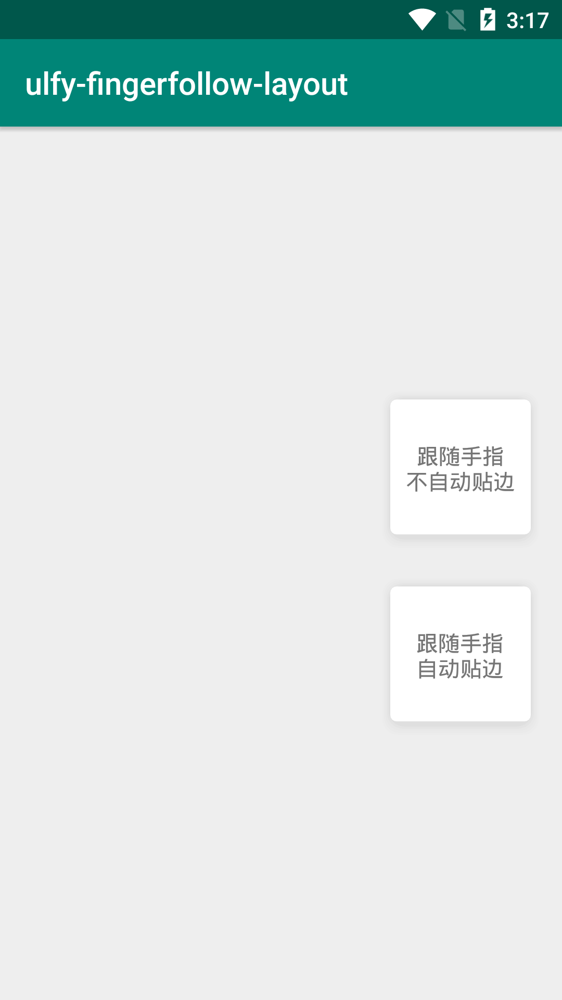

# ulfy-fingerfollow-layout

跟随手指移动的布局



# 引入依赖

[  ](https://bintray.com/ulfyyang/ulfy-maven/fingerfollow-layout/_latestVersion)

```groovy
implementation 'com.ulfy.android.controls:fingerfollow-layout:x.x.x'
```

# 不自动贴边布局

```xml
<com.ulfy.android.controls.FingerFollowLayout
    android:layout_width="wrap_content"
    android:layout_height="wrap_content"
    app:action_mode="position_fixed">
    
    ...
    
</com.ulfy.android.controls.FingerFollowLayout>
```

# 自动贴边布局

```xml
<com.ulfy.android.controls.FingerFollowLayout
    android:layout_width="wrap_content"
    android:layout_height="wrap_content"
    app:action_mode="auto_attach_side">
    
    ...
    
</com.ulfy.android.controls.FingerFollowLayout>
```

# 关于边距

通常情况下布局是不会死贴在屏幕边界的，可以通过设置margin来设置组件的边距。当自动贴边时会排除掉横向的margin。